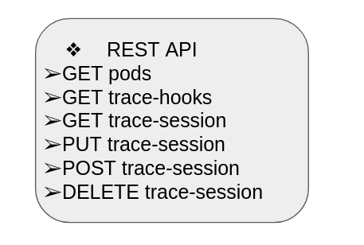

# trace-kube REST API
  
The REST API is the only way to interact with `trace-kube`. It is served by both `tracer-svc`
and `tracer-node` modules.  
## Version 1
### Get PODs
`GET /v1/pods` Get list of all PODs running on the node / cluster.
The format of one entry from the list is:

``` shell
...
"<pod name>": {
    "Containers": {
      "<container name>": {
        "Id": "<container id>",
        "Parent": [
          <PID of the parent process>
        ],
        "Pod": "<pod name>",
        "Tasks": [
          <PID of the container process>
        ]
      }
    }
  },
...
```


Example request `curl http://<node>:<port>/v1/pods --header "Content-Type: application/json" --request "GET" | jq`
to get a list of all pods. The entry describing a jaeger operator pod looks like that:

``` shell
...
  "jaeger-operator-7b46f44865-jvgz8": {
    "Containers": {
      "jaeger-operator": {
        "Id": "jaeger-operator",
        "Parent": [
          7337
        ],
        "Pod": "jaeger-operator-7b46f44865-jvgz8",
        "Tasks": [
          1002496
        ]
      },
      "kube-rbac-proxy": {
        "Id": "kube-rbac-proxy",
        "Parent": [
          7337
        ],
        "Pod": "jaeger-operator-7b46f44865-jvgz8",
        "Tasks": [
          7438
        ]
      }
    }
  },
...
```

### Get Trace Hooks
`GET /v1/trace-hooks` Get list of all trace-hooks, available for attaching to a container.
The format of one entry from the list is:

``` shell
...
{
  "<relative path of the directory, where the trace hook is located>": {
    "Tracers": {
      "<name of the trace hook>": {
        "Description": [
            "<multi line description of the trace hook>",
            "<usually the trace hook specific arguments>",
            "<are described here>"
        ],
        "Name": "<name of the trace hook>"
      }
    }
  }
},
...
```

Example request `curl http://<node>:<port>/v1/trace-hooks --header "Content-Type: application/json" --request "GET" | jq`
to get a list of all trace hooks. The entry describing the `trace_syscalls` hook looks like that:

``` shell
...
{
  "trace-hooks/ftrace": {
    "Tracers": {
      "trace_syscalls": {
        "Description": [
          "Trace system calls, used by given container",
          "-s, --syscall [SYSCALL ...] : list of System call names to be traced, optional argument.",
          "If no system calls are specified, all available are traced.",
          "-t, --time TIME : Duration of the trace in milliseconds, optional argument"
        ],
        "Name": "trace_syscalls"
      }
    }
  }
},
...
```

### Trace sessions management
#### Get configured trace sessions
`GET /v1/trace-session/<id>` Get description of a trace session with specific **id**.
If **all** is passed as **id**, list of all configured trace sessions is returned. The format of
returned entry, describing one trace sessions, is:

```shell
...
{
  "<trace session id>": {
    "Containers": {
      "<pod id>": [
        "<container id in this pod>"
      ],
    },
    "Context": "<user specified description of the session>",
    "Error": <error returned by the trace hook when starting the session, or **null** if there is no error>,
    "Id": "<trace session id>",
    "Node": "<name of the node, where this session is configured>",
    "Output": <output returned by the trace hook when starting the session, or **null** if there is no output>,
    "Running": <running state of the session>,
    "TraceHook": "<name of the trace hook, attached to containers from this session>",
    "TraceParams": [<list of specific parameters, passed to the trace hook>]
  }
}
...
```

Example request `curl http://<node>:<port>/v1/trace-session/6903485068587058765 --header "Content-Type: application/json" --request "GET" | jq`
to get the description of a trace session with id `6903485068587058765`:

```shell
...
{
  "6903485068587058765": {
    "Containers": {
      "jaeger-599bd8cddd-f6tcj": [
        "jaeger"
      ],
      "jaeger-agent-daemonset-4fpcc": [
        "jaeger-agent-daemonset"
      ],
      "jaeger-operator-7b46f44865-jvgz8": [
        "kube-rbac-proxy",
        "jaeger-operator"
      ]
    },
    "Context": "test",
    "Error": null,
    "Id": "6903485068587058765",
    "Node": "calisto.zico.biz",
    "Output": null,
    "Running": false,
    "TraceHook": "trace_syscalls",
    "TraceParams": []
  }
}
...
```

#### Create a new trace session
`POST /v1/trace-session` Create a new trace session. It requires a mandatory json file with session
description to be passed as part of this request. The format of this file is:

``` shell
...
{
	"pod": "<name of the pod to be traced, wildcards are supported to specify more than one pod>",
	"container": "<name of the container from specified pods to be traced, wildcards are supported to specify more than one container>",
	"trace-hook": "<name of the trace hook, that will be attached to the traced containers>",
	"trace-arguments": "<specific trace hooks arguments, used in this trace session>",
	"trace-user-context": "<custom context, attached to all traces>"
}
...
```

If the request is successful, a description of the newly created trace session is returned.
The session is not started by default.  
Example request to trace all containers in all jaeger pods:  
`curl http://<node>:<port>/v1/trace-session --header "Content-Type: application/json" --request "POST" -d @session.json | jq`  
where the `session.json` file is:

``` shell
...
{
	"pod": "jaeger*",
	"container": "*",
	"trace-hook": "trace_syscalls",
	"trace-arguments": "",
	"trace-user-context": "test"
}
...
```

#### Change state of a trace session
`PUT /v1/trace-session/<id>` Set the running state of a trace session with given **id**.
It requires a mandatory json file with the new session state. The format of this file is:

``` shell
...
{
	"Run": <session state>
}
...
```

If the request is successful, an empty json is returned.  
Example request to run a trace session with id **6903485068587058765**:  
`curl http://<node>:<port>/v1/trace-session/6903485068587058765 --header "Content-Type: application/json" --request "PUT" -d @run.json | jq`  
where the `run.json` file is:

``` shell
...
{
	"Run": true
}
...
```

#### Delete a trace session
`DELETE /v1/trace-session/<id>` Delete a trace session with given **id**. If **all** is passed as **id**,
all trace sessions will be deleted. If the session is running, it will be stopped before deletion.
If the request is successful, an empty json is returned.  
Example request to delete all trace sessions:  
`curl http://<node>:<port>/v1/trace-session/all --header "Content-Type: application/json" --request "DELETE" | jq`
