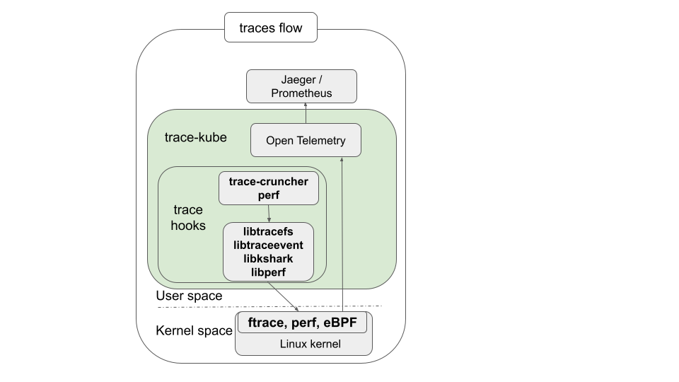

# trace-kube flow of traces
  
A set of trace hooks is used to interact with the tracing infrastructure of the Linux kernel.
Look at [trace-hooks](trace-hooks.md) for a complete description of the trace hooks.  
Typical traces flow is illustrated on the diagram. For interaction with `ftrace`,
the python library `trace-cruncher` is used. It relies on a set of low level libraries
to configure ftrace in a separate trace instance, specific to this run of the trace session.
The output is recorded in a trace file in this trace instance, which is located in the kernel
pseudo file system. As the space there is limited, the Open Telemetry logger must read the file
during the trace and export the traces to an external database.